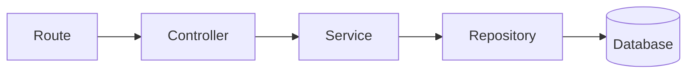
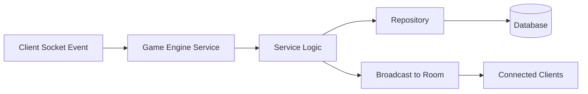

# GitGud Milestone 1 Architecture

## Scope
This document defines the Milestone 1 backend architecture for GitGud, a browser-based multiplayer social deduction game for learning software engineering through code review and debugging.

The stack for this milestone is:
- React + Vite
- Node.js + Express
- TypeScript
- Drizzle ORM
- Supabase PostgreSQL
- Socket.io
- Turborepo monorepo

This milestone is documentation-first. It defines the service split, data model, ownership rules, and request/socket flows.

---

## 1. Microservice Design

### Microservice 1: Auth & Lobby Service

Primary responsibility: player identity and match entry coordination.

Responsibilities:
- GitHub authentication
- JWT issuance and verification
- user profile management
- lobby creation and discovery
- join room flow
- leave room flow
- ready status updates
- match initialization

Owns the lifecycle before the game starts. This service prepares a lobby, collects players, verifies readiness, and creates the match record that the Game Engine Service will use.

Core endpoints:
- `POST /auth/github`
- `POST /auth/logout`
- `GET /me`
- `POST /lobbies`
- `GET /lobbies/:id`
- `POST /lobbies/:id/join`
- `POST /lobbies/:id/leave`
- `POST /lobbies/:id/ready`
- `POST /lobbies/:id/start`

### Microservice 2: Game Engine Service

Primary responsibility: running the active match.

Responsibilities:
- role assignment
- task assignment
- commit submission
- diff review
- ship readiness tracking
- voting
- emergency meetings
- match timer management
- match result calculation
- learning recap generation

Owns everything that happens after match start. This service consumes the match created by the lobby service and advances the game state until completion.

Core endpoints:
- `GET /matches/:id`
- `POST /matches/:id/roles/assign`
- `POST /matches/:id/tasks/assign`
- `POST /matches/:id/commits`
- `POST /matches/:id/reviews`
- `POST /matches/:id/meetings`
- `POST /matches/:id/votes`
- `POST /matches/:id/timer/start`
- `POST /matches/:id/result`
- `GET /matches/:id/recap`

---

## 2. Database Design

All data lives in the same Supabase PostgreSQL instance and is accessed through Drizzle.

Only important attributes are listed below.

### `users`
Stores authenticated players.
- `id` UUID, primary key
- `github_id` text, unique
- `username` text
- `avatar_url` text
- `display_name` text
- `created_at` timestamp

### `lobbies`
Stores pre-match rooms.
- `id` UUID, primary key
- `host_user_id` UUID, foreign key to `users.id`
- `status` text, for example `open`, `full`, `starting`, `closed`
- `max_players` integer
- `join_code` text, unique
- `created_at` timestamp

### `lobby_players`
Join table for users inside a lobby.
- `id` UUID, primary key
- `lobby_id` UUID, foreign key to `lobbies.id`
- `user_id` UUID, foreign key to `users.id`
- `is_ready` boolean
- `joined_at` timestamp

### `matches`
Stores active and completed matches.
- `id` UUID, primary key
- `lobby_id` UUID, foreign key to `lobbies.id`
- `status` text, for example `active`, `paused`, `finished`
- `started_at` timestamp
- `ended_at` timestamp
- `ship_readiness` integer
- `timer_seconds_remaining` integer

### `tasks`
Stores match tasks that players can work on.
- `id` UUID, primary key
- `match_id` UUID, foreign key to `matches.id`
- `title` text
- `description` text
- `difficulty` text
- `status` text, for example `todo`, `doing`, `done`
- `is_sabotage` boolean

### `player_tasks`
Tracks task assignment per player.
- `id` UUID, primary key
- `match_id` UUID, foreign key to `matches.id`
- `task_id` UUID, foreign key to `tasks.id`
- `user_id` UUID, foreign key to `users.id`
- `assigned_at` timestamp
- `completed_at` timestamp

### `commits`
Stores submitted code changes and review artifacts.
- `id` UUID, primary key
- `match_id` UUID, foreign key to `matches.id`
- `user_id` UUID, foreign key to `users.id`
- `commit_hash` text
- `message` text
- `diff_text` text
- `review_status` text, for example `pending`, `approved`, `rejected`
- `created_at` timestamp

### `meetings`
Stores emergency meetings and discussion rounds.
- `id` UUID, primary key
- `match_id` UUID, foreign key to `matches.id`
- `triggered_by_user_id` UUID, foreign key to `users.id`
- `reason` text
- `started_at` timestamp
- `ended_at` timestamp

### `votes`
Stores meeting votes.
- `id` UUID, primary key
- `meeting_id` UUID, foreign key to `meetings.id`
- `match_id` UUID, foreign key to `matches.id`
- `voter_user_id` UUID, foreign key to `users.id`
- `target_user_id` UUID, nullable foreign key to `users.id`
- `created_at` timestamp

### `match_results`
Stores the final outcome and recap data.
- `id` UUID, primary key
- `match_id` UUID, foreign key to `matches.id`, unique
- `winner_team` text, for example `crew` or `imposters`
- `ending_reason` text
- `summary` text
- `learning_recap` text
- `created_at` timestamp

### Ownership Matrix

| Table | Owner Service | Read Access By |
| --- | --- | --- |
| `users` | Auth & Lobby Service | Game Engine Service |
| `lobbies` | Auth & Lobby Service | Game Engine Service |
| `lobby_players` | Auth & Lobby Service | Game Engine Service |
| `matches` | Game Engine Service | Auth & Lobby Service |
| `tasks` | Game Engine Service | Auth & Lobby Service |
| `player_tasks` | Game Engine Service | Auth & Lobby Service |
| `commits` | Game Engine Service | Auth & Lobby Service |
| `meetings` | Game Engine Service | Auth & Lobby Service |
| `votes` | Game Engine Service | Auth & Lobby Service |
| `match_results` | Game Engine Service | Auth & Lobby Service |

---

## 3. Relationships Between Tables

- One `users` row can appear in many `lobby_players`, `commits`, `player_tasks`, `votes`, and `meetings` rows.
- One `lobbies` row has many `lobby_players` rows.
- One `lobbies` row creates one `matches` row when the lobby starts.
- One `matches` row has many `tasks`, `player_tasks`, `commits`, `meetings`, and `match_results` rows.
- One `tasks` row can be assigned to many players through `player_tasks`.
- One `meetings` row has many `votes` rows.
- One `matches` row has exactly one `match_results` row.

Recommended constraints:
- unique `users.github_id`
- unique `lobbies.join_code`
- unique `(lobby_players.lobby_id, lobby_players.user_id)`
- unique `(player_tasks.match_id, player_tasks.task_id, player_tasks.user_id)` if a task should not be assigned twice to the same player
- unique `match_results.match_id`

---

## 4. Database Ownership Across Microservices

This is the most important boundary.

We are **not duplicating schemas**.
Both services use the same Supabase PostgreSQL instance.
Each microservice owns only its own tables.
A service may read another service’s tables when required.
Only the owner service performs writes.

### Ownership Rules

#### Auth & Lobby Service owns:
- `users`
- `lobbies`
- `lobby_players`

This service writes user identities, lobby state, membership changes, and the match-start handoff.

#### Game Engine Service owns:
- `matches`
- `tasks`
- `player_tasks`
- `commits`
- `meetings`
- `votes`
- `match_results`

This service writes all active gameplay data and final match outcomes.

### Read Access Rules

- Game Engine Service may read `users`, `lobbies`, and `lobby_players` to resolve player identity and lobby membership.
- Auth & Lobby Service may read `matches` and `match_results` to show match status after initialization.
- Cross-service reads are allowed for orchestration and display.
- Cross-service writes are not allowed.

### Why this matters

This avoids schema duplication, keeps writes single-owner, and reduces race conditions. It also makes debugging easier because each table has one source of truth.

### Match Initialization Sequence

1. Auth & Lobby Service verifies all players are ready.
2. Auth & Lobby Service creates the `matches` row through the Game Engine Service contract.
3. Game Engine Service assigns hidden roles and creates match tasks.
4. Game Engine Service creates initial `player_tasks` assignments.
5. Both services read the shared `match_id` as the single handoff identifier for the active session.

---

## 5. Request Flow

### HTTP Request Flow

Typical example:
- Route receives `POST /lobbies/:id/join`
- Controller validates input and auth
- Service applies lobby rules
- Repository writes to PostgreSQL through Drizzle
- Database persists the change and returns the updated lobby state

Typical auth/lobby example flow:
- Route handles `POST /lobbies/:id/start`
- Controller confirms the caller is the lobby host
- Service checks that all players are ready
- Repository updates the lobby and creates the match handoff
- Game Engine Service initializes roles and tasks for the new match

### Socket Communication Flow

Typical example:
- client emits `commit:submit`
- Game Engine Service validates the event
- Service writes the commit to the database
- Service computes any state updates such as ship readiness
- Service broadcasts the result to all players in the room

---

## 6. Socket Communication Flow

The socket layer is used for real-time gameplay once a match is active.

Core events handled by the Game Engine Service:
- `match:join`
- `task:assign`
- `commit:submit`
- `commit:review`
- `meeting:start`
- `vote:cast`
- `timer:tick`
- `match:ended`
- `recap:ready`

Common socket flow:

1. Client emits an event to the active match room.
2. Game Engine Service validates JWT, room membership, and match state.
3. Game Engine Service writes the authoritative update to the database.
4. Game Engine Service recalculates derived state such as ship readiness or vote outcomes.
5. Game Engine Service broadcasts the update to the room.
6. Clients re-render from the broadcast payload and not from local state alone.

Representative game events:
- `commit:submit` stores a commit and may update ship readiness.
- `commit:review` updates review status and can trigger task progress.
- `meeting:start` opens a timed emergency meeting.
- `vote:cast` stores a vote and checks for majority or tie conditions.
- `match:ended` freezes the match and writes the result row.
- `recap:ready` exposes the end-of-match learning summary.

Socket principles:
- all socket writes go through the Game Engine Service
- database state is updated first, then the room is broadcast
- clients never become the source of truth for match state
- room broadcasts are scoped by lobby or match id

---

## 7. Milestone 1 Outcome

Milestone 1 should leave us with:
- a clear split between authentication/lobby and gameplay concerns
- a single shared Supabase database with strict ownership boundaries
- a Drizzle schema plan ready for implementation
- an HTTP and socket flow that supports the later gameplay build-out
